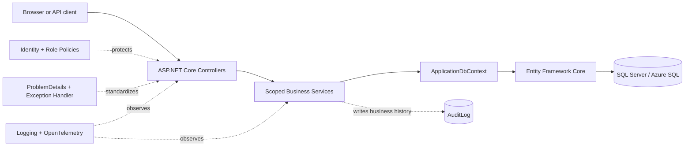
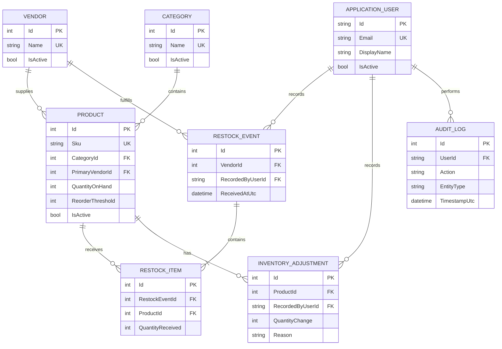
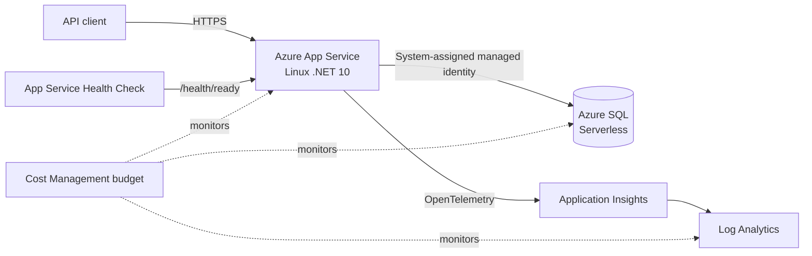

# BP Franchise Inventory & Operations Management System

An ASP.NET Core backend for the back-office inventory operations of a
single-location convenience store. The project is inspired by the operational
needs of a real independently owned BP franchise, while the repository and
public Azure deployment use synthetic demonstration data only. It provides a
complete API for merchandise catalogs, current stock, deliveries, accountable
inventory adjustments, low-stock reporting, audit history, and role-based user
administration.

## Why this project exists

A small convenience store needs more than a current quantity column. Employees
must be able to record deliveries and damaged or missing items, managers need to
maintain the merchandise catalog and investigate business history, and
administrators need to control access. This system keeps current inventory fast
to query while preserving the history and authenticated actor behind each
change.

## Technology stack

- C# and ASP.NET Core Web API on .NET 10
- Entity Framework Core 10 and SQL Server
- ASP.NET Core Identity with secure cookie authentication
- xUnit and `WebApplicationFactory` integration tests
- Azure App Service for Linux
- Azure SQL Database with passwordless managed identity
- Azure Monitor OpenTelemetry, Application Insights, and Log Analytics
- Built-in OpenAPI in Development

## Architecture

The application is a modular monolith with one deployable API and one relational
database. Controllers stay at the HTTP boundary, scoped services own business
rules and transaction orchestration, and services use `ApplicationDbContext`
directly.



Request flow:

```text
Controllers → Services → ApplicationDbContext → EF Core → SQL Server
```

See the detailed [application architecture](docs/architechture/architecture.md)
and [request lifecycle](docs/architechture/request-lifecycle.md).

## Core features

- Category and Vendor create, read, update, soft deactivation, and reactivation
- Product management with search, filters, pagination, and allow-listed sorting
- Active-only low-stock reporting using
  `QuantityOnHand <= ReorderThreshold`
- Multi-item Restocks that atomically create history and increase stock
- Inventory Adjustments with reasons and negative-stock prevention
- Immutable Restock, Adjustment, and AuditLog history through the public API
- ASP.NET Core Identity login, logout, current-user, and password-change flows
- Employee, Manager, and Admin authorization policies
- Admin user creation, role management, deactivation, and reactivation
- Centralized validation, exception handling, and RFC-style ProblemDetails
- Idempotent synthetic demo data with externally supplied passwords
- Application and SQL readiness health checks
- Azure request and SQL dependency telemetry

### Inventory integrity

Product CRUD never edits `QuantityOnHand`, and a new Product always starts at
zero. Inventory changes occur through an explicit Restock or Inventory
Adjustment so the system retains an explanation and actor.

Restocks and Adjustments use explicit SQL `Serializable` transactions. A
multi-item Restock commits its header, lines, all Product quantity changes, and
AuditLog together. An Adjustment commits its history, Product quantity, and
AuditLog together. Any failure rolls back the complete operation.

## Roles and permissions

| Capability | Employee | Manager | Admin |
| --- | :---: | :---: | :---: |
| View Products and low stock | Yes | Yes | Yes |
| Record Restocks and Adjustments | Yes | Yes | Yes |
| Manage Products, Categories, and Vendors | No | Yes | Yes |
| View AuditLog | No | Yes | Yes |
| Manage users and roles | No | No | Yes |

Authentication uses Secure, HttpOnly, SameSite Strict cookies. Unsafe requests
also require the `X-CSRF-TOKEN` antiforgery header. The API derives audit actor
identity from the authenticated server context; business request bodies never
accept an actor user ID.

See the complete [authorization matrix](docs/security/authorization-matrix.md)
and [security architecture](docs/security/security-architecture.md).

## Data model



The full schema is documented in the [ER diagram](docs/database/er-diagram.md)
and [data dictionary](docs/database/data-dictionary.md).

## API overview

| Area | Routes | Access |
| --- | --- | --- |
| Authentication | `/api/auth/antiforgery-token`, `/login`, `/me`, `/logout`, `/change-password` | Anonymous/authenticated |
| Products | `/api/products`, `/api/products/{id}`, `/api/products/low-stock` | Employee+ reads, Manager+ mutations |
| Categories | `/api/categories`, `/api/categories/{id}` | Employee+ reads, Manager+ mutations |
| Vendors | `/api/vendors`, `/api/vendors/{id}` | Employee+ reads, Manager+ mutations |
| Restocks | `/api/restocks`, `/api/restocks/{id}` | Employee+ |
| Adjustments | `/api/inventory-adjustments`, `/api/inventory-adjustments/{id}` | Employee+ |
| Audit history | `/api/audit-logs`, `/api/audit-logs/{id}` | Manager+ |
| User administration | `/api/users`, `/api/users/{id}` and role/status actions | Admin |
| Health | `/health`, `/health/ready` | Anonymous |

List endpoints apply filtering, sorting, and pagination in SQL and use
`AsNoTracking()` for appropriate read-only queries. The default page size is 25
and the maximum is 100.

The complete routes and contracts are in the [endpoint matrix](docs/api/endpoint-matrix.md),
[DTO contracts](docs/api/dto-contracts.md), and [API examples](docs/api/api-examples.md).
When running in Development, the built-in OpenAPI document is available at
`/openapi/v1.json`. It is intentionally unavailable in Production.

## Local development

### Prerequisites

- .NET 10 SDK
- SQL Server Express at `.\SQLEXPRESS`, or an equivalent SQL Server connection
- PowerShell, Visual Studio, or another .NET-compatible terminal

The checked-in Development configuration targets:

```text
Server=.\SQLEXPRESS;Database=BPInventoryOps;Trusted_Connection=True
```

Change only your local Development configuration if your SQL Server instance is
different. Do not commit credentials.

### Restore and migrate

From the repository root:

```powershell
dotnet restore BPInventoryOps.slnx
dotnet tool restore --tool-manifest dotnet-tools.json
$env:ASPNETCORE_ENVIRONMENT = "Development"
dotnet tool run dotnet-ef database update `
  --project BPInventoryOps.Api/BPInventoryOps.Api.csproj `
  --startup-project BPInventoryOps.Api/BPInventoryOps.Api.csproj
```

### Optional local demo data

Demo seeding is disabled by default. To enable it for a local session, provide
three distinct strong passwords outside source control:

```powershell
$env:SeedData__Enabled = "true"
$env:SeedData__DemoEmployeePassword = "<strong local-only password>"
$env:SeedData__DemoManagerPassword = "<different strong local-only password>"
$env:SeedData__DemoAdminPassword = "<different strong local-only password>"
```

The synthetic accounts are:

```text
employee@bp-inventory.demo
manager@bp-inventory.demo
admin@bp-inventory.demo
```

The seeder is idempotent and does not overwrite existing passwords. Clear the
password environment variables when the session ends.

### Run

```powershell
dotnet run --project BPInventoryOps.Api/BPInventoryOps.Api.csproj `
  --launch-profile https
```

Default Development addresses are:

```text
https://localhost:7104
http://localhost:5203
```

## Testing

The test suite exercises the real ASP.NET Core pipeline with
`WebApplicationFactory`, Identity cookies, antiforgery, EF Core, real migrations,
and disposable SQL Server Express databases named with the safe
`BPInventory_Test_` prefix. It does not use EF Core InMemory as evidence for SQL
behavior.

Run:

```powershell
dotnet test BPInventoryOps.slnx --configuration Release
```

Current verified result:

```text
11 passed, 0 failed, 0 skipped
```

Coverage focuses on catalog rules, soft deactivation, query behavior, low-stock
boundaries, Restock atomicity, Adjustment integrity, audit attribution,
authentication/authorization, user administration, and safe health responses.
See the [testing strategy](docs/testing/testing-strategy.md).

## Azure deployment

The portfolio API is deployed at:

```text
https://bpinventoryops-api-kc.azurewebsites.net
```

The Free App Service may be stopped between demonstrations. The live readiness
endpoint is [https://bpinventoryops-api-kc.azurewebsites.net/health/ready](https://bpinventoryops-api-kc.azurewebsites.net/health/ready).



The App Service stores no SQL password. Its managed identity has only
`db_datareader` and `db_datawriter`; a separate Microsoft Entra deployment
identity applies reviewed EF migration bundles. Azure SQL allows the App
Service's documented outbound IPs, while the broad “Allow Azure services” rule
is disabled.

Deployment verification covered the complete canonical flow: Employee login,
low stock, multi-item Restock, damage Adjustment, negative-stock rejection,
Employee `403`, Manager catalog and AuditLog access, Admin role management,
healthy SQL readiness, and Application Insights request/dependency telemetry.

See the [Phase 5 deployment record](docs/azure-deployment/phase-5-deployment-record.md)
and [Azure deployment architecture](docs/azure-deployment/azure-deployment-architecture.md).

## Key engineering decisions

- **Modular monolith:** appropriate for one location and one closely related
  domain without distributed-system cost.
- **Direct DbContext usage:** EF Core already provides repository and unit-of-work
  behavior, so generic repository and UnitOfWork wrappers were omitted.
- **DTO/entity separation:** prevents over-posting and keeps persistence details
  out of the HTTP contract.
- **Current state plus history:** Product quantities support fast reads while
  Restocks and Adjustments explain changes.
- **Serializable inventory transactions:** prevent partial multi-record mutations
  and normal lost-update scenarios.
- **Soft deactivation:** preserves historical foreign-key relationships.
- **Cookie authentication plus antiforgery:** matches the internal browser-oriented
  application rather than introducing custom JWT issuance.
- **Managed identity:** removes runtime SQL passwords and separates runtime CRUD
  permission from schema deployment.
- **Real SQL integration tests:** validate SQL translation, migrations,
  constraints, transactions, and the actual HTTP/security pipeline.

Additional rationale is available in the [architecture decisions](docs/architechture/architecture-decisions.md),
[security decisions](docs/security/security-decisions.md), and
[Azure deployment decisions](docs/azure-deployment/azure-deployment-decisions.md).

## Demo evidence

There is intentionally no frontend or invented UI screenshot. The project is a
backend demonstration, with evidence provided by:

- the Development OpenAPI document;
- automated API integration tests;
- the live readiness endpoint when the Free App Service is running;
- the documented Azure canonical workflow;
- Application Insights request and SQL dependency verification;
- the architecture and ER diagrams above.

## Intentional scope

The MVP deliberately excludes:

- POS/register, customer checkout, and payment integration
- fuel pumps, tanks, and fuel pricing
- automatic sales-based stock decrementing
- multi-store operations
- purchase orders, vendor invoicing, accounting, payroll, and scheduling
- barcode hardware, mobile applications, and AI forecasting
- microservices, Redis, message queues, Kubernetes, and Terraform
- a production frontend
- automated Azure CI/CD

These exclusions keep the project focused on a secure, transactional,
well-tested inventory backend rather than presenting unimplemented features as
complete.

## Documentation

Start with the [authoritative implementation specification](docs/codex-implementation-spec.md).
Supporting business, API, database, security, testing, demo, architecture, and
Azure decisions are organized under [`docs/`](docs/).
