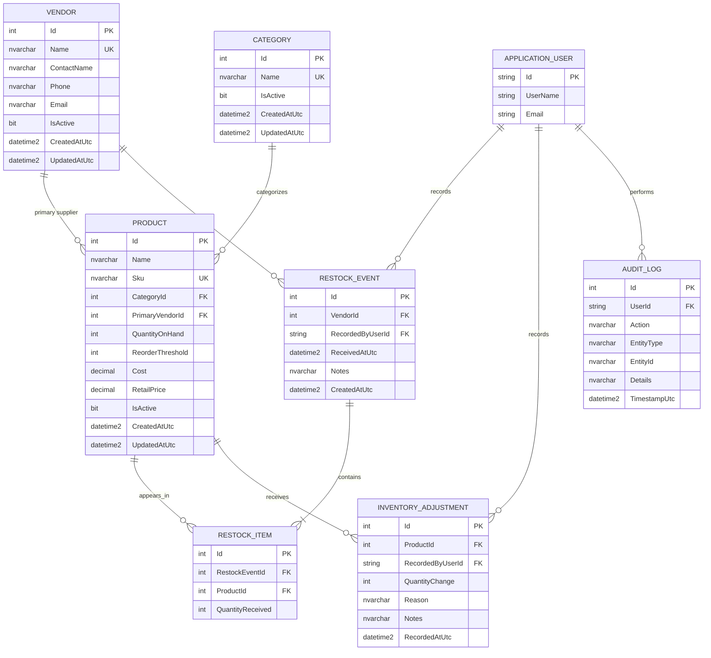

# ER Diagram

This document contains the conceptual MVP ER diagram for the BP Franchise Inventory & Operations Management System.

ASP.NET Core Identity will generate the physical authentication tables later. `ApplicationUser` is shown conceptually so domain relationships to the authenticated user are clear.

## Cardinality Legend

- `||` = exactly one
- `o{` = zero or many
- `|{` = one or many

Examples:

`CATEGORY ||--o{ PRODUCT`

means:

- Each Product belongs to exactly one Category.
- A Category may contain zero or many Products.

`RESTOCK_EVENT ||--|{ RESTOCK_ITEM`

means:

- Each RestockItem belongs to exactly one RestockEvent.
- Each RestockEvent must contain one or more RestockItems.

## Key Design Pattern: RestockEvent + RestockItem

A delivery is modeled with a header-and-lines pattern.

Header:

`RestockEvent`

Lines:

`RestockItem`

This prevents repeating delivery-level data for every product and allows any number of products in one delivery.

The pattern is broadly reusable and resembles:

- Order + OrderItem
- Invoice + InvoiceLine
- PurchaseOrder + PurchaseOrderItem
